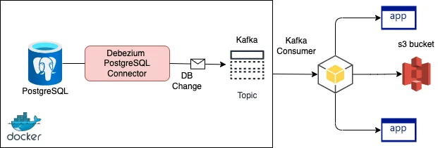

## Setup
### Motivation
1. Setup postgres instance
2. Setup debezium kafka connector
3. Stream wal to kafka stream per table basis

### Diagram
<p align="left">

</p>

### Setup debezium for source connector
```
$ curl -i -X POST -H "Accept:application/json" -H "Content-Type:application/json" 127.0.0.1:8083/connectors/ --data "@iceberg.json"
```

### Setup consumption
Run this in terminal
```
$ docker run --tty \
--network kc-test \
confluentinc/cp-kafkacat \
kafkacat -b broker:29092 -C \
-s key=s -s value=avro \
-r http://schema_registry:8081 \
-t postgres.public.ingredients
```

### Example postgres inserts
```
INSERT INTO ingredients
    (ingredient_id, ingredient_name, ingredient_price)
VALUES 
    (1, 'Beef', 5),
    (2, 'Lettuce', 1),
    (3, 'Tomatoes', 2);
```

### Check Topics (if neccessary)
```
$ docker run --network=kc-test confluentinc/cp-kafkacat kafkacat -b broker:9092 -L
```
or
```
$ docker run --network=kc-test confluentinc/cp-kafkacat kafkacat -b broker:9092 -t postgres.public.recipes -C 
```
or
```
docker exec -ti kafka-connect-broker-1 kafka-topics --list --bootstrap-server=localhost:9092
```

### Clean up (if neccessary)
```
$ docker stop $(docker ps -aq)  
$ docker system prune --all
$ docker volume rm $(docker volume ls -q)
```
